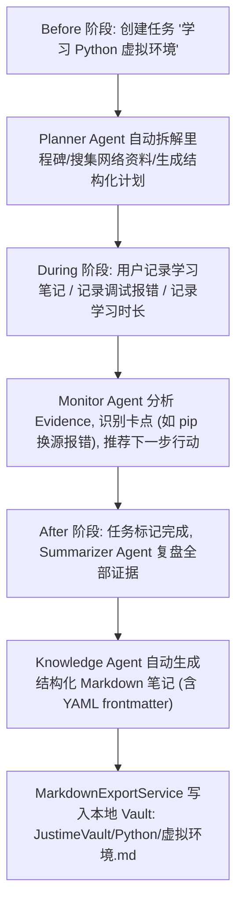
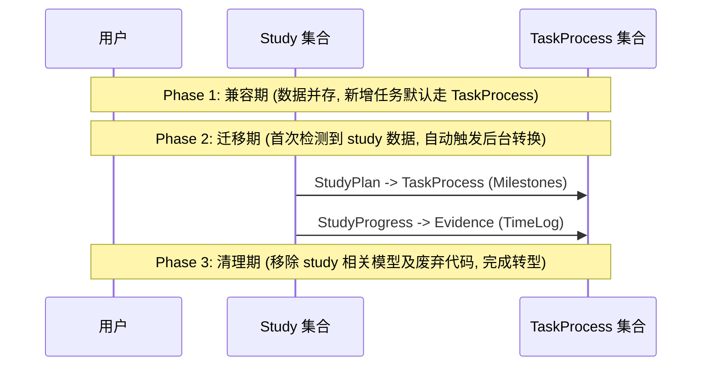

# Justime 项目方向调整与后续发展计划 (重构与完善版)

> 本文档将项目从「时间管理与任务分配平台」升级为「AI 驱动的个人任务进程操作系统」：不是简单记录任务，而是持续追踪任务 Before/During/After 状态、辅助任务推进、沉淀任务成果，并最终形成本地 Markdown 知识库。本文档已结合仓库实际代码评估，完成细节补全与架构修正。

---

## 〇、前置警示与方向抉择

> [!CAUTION]
> **本仓库已于 2026-05-30 完成了向「考研智能学习助手」的第一次转型 [TRANSFORMATION_PLAN.md](../design/TRANSFORMATION_PLAN.md)。**
> 本次调整为第二次转型，定位泛化为「AI 个人任务进程操作系统」。新定位在用户范围、产品价值和差异化竞争上均显著优于考研助手定位，但由于涉及到底层模型重构与桌面端开发，开发周期会有所延长。为确保项目成功，开发团队应承诺在 6 个月内保持该方向的稳定性。

---

## 1. 当前项目现状与底座评估

根据对当前仓库结构的实际审查，Justime 已经具备非常成熟的 AI 应用底座：

*   **前端**：`justime_agent`，基于 Next.js 14 (App Router) + React 18 + Tailwind CSS + Radix UI 搭建，拥有成熟 of ChatInterface (30KB) 与日程/仪表盘视图。
*   **后端**：`justime_backend`，基于 FastAPI + Python 3.10+ + Motor (async MongoDB) + Redis 7 搭建，已实现多模型路由 (ChatRouter)、流式 SSE (SSEStreamService) 及 RAG (rag_service) 架构。
*   **AI 能力**：多 Provider 动态切换，已集成 DeepSeek、OpenAI、DashScope 等，且具备书籍分析 (NotebookLM) 与文档检索基础。

本重构方案**不推荐**推倒重做，而是采用**「产品定位重构 + 现有 study/agent 模块重组 + 桌面端封装」**的演进路径。

---

## 2. 新产品定位与核心理念

### 2.1 一句话定位
**Justime 是一个运行在 macOS 上的 AI 个人任务进程管理器，用于持续追踪个人任务的前、中、后状态，并将任务过程与产出自动转化为本地结构化的 Obsidian 兼容 Markdown 知识库。**

### 2.2 核心设计理念

1.  **三阶段生命周期**：
    *   **Before (任务规划)**：AI 拆解子任务、搜集参考资料、生成系统性学习/执行计划。
    *   **During (任务执行)**：用户通过记录笔记、提交代码、对话、计时等留下客观 Evidence，AI 动态评估进度、识别 Blocker 并给出行动建议。
    *   **After (任务沉淀)**：任务完成后，AI 自动将过程中的 Evidence 融合成结构化的 KnowledgeOutput (Summary/FAQ/Tutorial)，写入本地 Markdown Vault。
2.  **Evidence (证据) 驱动进度**：进度不靠手动随意拖拽，而是基于执行过程中的客观证据自动评估，提供真实反馈。
3.  **Obsidian 本地优先**：所有的最终知识输出直接写入用户本地的 Obsidian Vault 中，完全保障用户数据私密性，无缝融入现有的 Obsidian 工作流。

---

## 3. 核心用户场景与闭环 Demo

以**「学习 Python 虚拟环境」**为例：



---

## 4. 架构设计与系统边界

Justime 采用前后端分离的双端架构：

*   **前端 Web (Next.js 14)**：负责 Process Cockpit (任务驾驶舱)、Before/During/After 详情页、绑卡式 ChatInterface 以及日历同步视图。
*   **macOS 原生壳 (SwiftUI/AppKit + WKWebView)**：加载现有 Web 前端并提供原生能力桥接；`apps/desktop` Electron 壳在原生发布门禁全部通过前继续作为生产 fallback。
*   **后端服务 (FastAPI)**：通过 `endpoints` -> `business` -> `services` 三层架构进行业务编排。

```
┌──────────────────────────────────────────────────────────────────┐
│  前端层: Next.js 14 (App Router) + Tailwind CSS + recharts        │
├──────────────────────────────────────────────────────────────────┤
│  API 代理层: src/app/api/ (Web/WKWebView 主路径继续使用 BFF)      │
├──────────────────────────────────────────────────────────────────┤
│  后端编排层: TaskProcessBusiness + ChatBusiness                  │
├──────────────────────────┬──────────┬──────────┬─────────────────┤
│ Chat                     │ TaskAgent│Calendar  │Knowledge        │
│ (SSE)                    │ (Service)│(Tools)   │ (RAG)           │
└──────────────────────────┴──────────┴──────────┴─────────────────┘
```

---

## 5. macOS 桌面端技术路线与选型

### 5.1 桌面壳选型：SwiftUI/AppKit + WKWebView 主路线

当前决策以 [macOS 原生迁移 ADR](../architecture/2026-06-26-macos-native-migration.md) 为准：

| 路线 | 架构说明 | 当前定位 |
|---|---|---|
| **SwiftUI/AppKit + WKWebView** | 原生 SwiftUI 壳通过 WKWebView 加载现有 Next.js 应用，并使用版本化 bridge 逐步提供文件、通知、窗口与更新能力。 | **主路线**；`apps/macos-native` 已建立并通过无凭据构建/测试与 smoke gate。 |
| **Electron + Next.js** | `apps/desktop` 继续承载现有 Web 应用。 | **生产 fallback**；原生认证、SSE、任务工作台、签名/公证与自动更新门禁全部通过前不得移除。 |
| **Tauri** | Rust 插件模型与另一套工具链会提高当前 TypeScript/Python 团队的维护成本。 | **Phase 1 明确不采用**；仅在未来跨平台统一成为优先目标时重新评估。 |

Phase 2 采用逐屏迁移：Chat 和 Calendar 的 SwiftUI 实现目前只是 parity candidate，生产路由所有权仍属于 WKWebView Web 页面；只有独立 promotion issue 提交完整等价性、遥测、回滚和发布门禁证据后，单个路由才能切换。

### 5.2 后端运行方案：分层演进策略

1.  **Phase 1 (MVP)**：**现有 Web + 云端/已部署后端**。WKWebView 加载现有 Next.js 应用，由 Web/BFF 路径访问 FastAPI；本阶段不同时引入本地后端复杂性。
2.  **Phase 2 (混合版)**：**本地打包运行**。使用 `PyInstaller` 将 FastAPI + 依赖打包成单个可执行二进制（Sidecar）。数据库使用本地 SQLite（替代 MongoDB 简化环境），Redis 缓存使用内嵌的内存结构。
3.  **Phase 3 (本地纯净版)**：**全面本地化**。集成本地 Ollama (LLM) 和 ChromaDB (RAG)，实现离线运行与彻底的隐私保护。

---

## 6. 后端数据模型重构方案

> [!IMPORTANT]
> **演化策略**：不要从零重建，而是泛化已有的 `study.py` 模型，将字段向后兼容，以支持全品类任务。

```
已有 Study 模型 ────────────▶ 新 TaskProcess 映射
StudyProfile (目标) ───────▶ TaskProcess.goal + context
StudyPlan (计划阶段) ──────▶ TaskProcess.milestones
StudyTask (具体任务) ──────▶ TaskProcess.parent_task_id (子任务嵌套)
StudyProgress (学习进度) ──▶ Evidence (type='time_log')
ReviewSchedule (复习进度) ─▶ KnowledgeOutput 复习维度 (SM-2)
```

### 6.1 TaskProcess 模型 (`justime_backend/app/models/task_process.py`)

追踪任务的完整生命周期：

```python
from datetime import datetime
from typing import Any, Dict, List, Literal, Optional
from pydantic import BaseModel, Field

TaskStatus = Literal["draft", "planned", "active", "paused", "blocked", "completed", "archived"]
TaskPhase = Literal["before", "during", "after"]
TaskPriority = Literal["low", "medium", "high", "critical"]
TaskCategory = Literal["learning", "development", "writing", "research", "reading", "project", "practice", "other"]

class Milestone(BaseModel):
    """里程碑 (从 StudyPlan.PlanPhase 演化)"""
    id: str
    title: str = Field(..., max_length=200)
    description: str = Field("", max_length=2000)
    order: int = Field(0, ge=0)
    status: Literal["pending", "active", "completed", "skipped"] = "pending"
    target_date: Optional[datetime] = None
    completed_at: Optional[datetime] = None

class Blocker(BaseModel):
    """阻塞点"""
    id: str
    description: str = Field(..., max_length=2000)
    severity: Literal["low", "medium", "high"] = "medium"
    resolved: bool = False
    resolution: Optional[str] = None
    created_at: datetime = Field(default_factory=datetime.utcnow)
    resolved_at: Optional[datetime] = None

class AISuggestion(BaseModel):
    """AI 建议"""
    id: str
    type: Literal["next_step", "resource", "review", "alert", "optimization"]
    content: str = Field(..., max_length=5000)
    accepted: Optional[bool] = None
    created_at: datetime = Field(default_factory=datetime.utcnow)

class AIAssessment(BaseModel):
    """AI 进度评估结构"""
    progress: float = Field(..., ge=0.0, le=1.0)
    confidence: float = Field(..., ge=0.0, le=1.0)
    summary: str = Field("", max_length=2000)
    blockers_identified: List[str] = Field(default_factory=list)
    next_steps: List[str] = Field(default_factory=list)
    assessed_at: datetime = Field(default_factory=datetime.utcnow)

class TaskProcessOut(BaseModel):
    id: str
    userId: str
    title: str = Field(..., max_length=200)
    description: str = Field("", max_length=5000)
    goal: str = Field(..., max_length=2000)
    category: TaskCategory = "other"
    tags: List[str] = Field(default_factory=list)
    status: TaskStatus = "draft"
    phase: TaskPhase = "before"
    priority: TaskPriority = "medium"
    progress: float = 0.0
    progress_source: Literal["manual", "ai", "evidence"] = "manual"
    estimated_hours: Optional[float] = None
    actual_hours: float = 0.0
    started_at: Optional[datetime] = None
    completed_at: Optional[datetime] = None
    deadline: Optional[datetime] = None
    
    # 结构化子模型
    milestones: List[Milestone] = Field(default_factory=list)
    blockers: List[Blocker] = Field(default_factory=list)
    ai_suggestions: List[AISuggestion] = Field(default_factory=list)
    ai_last_assessment: Optional[AIAssessment] = None
    ai_plan: Optional[Dict[str, Any]] = None  # AI 自动拆解的详情

    # 软引用关系
    parent_task_id: Optional[str] = None
    related_chat_session_ids: List[str] = Field(default_factory=list)
    related_calendar_event_ids: List[str] = Field(default_factory=list)
    createdAt: datetime
    updatedAt: datetime
```

### 6.2 Evidence 模型 (`justime_backend/app/models/evidence.py`)

放弃手动拖进度，依据多维客观证据更新进度：

```python
class EvidenceOut(BaseModel):
    id: str
    task_id: str
    userId: str
    type: Literal['note', 'file', 'chat', 'code_commit', 'link', 'time_log', 
                   'quiz_result', 'review', 'milestone_complete', 'manual']
    title: str = Field("", max_length=200)
    content: str = Field(..., max_length=50000)
    source: str = Field("", description="来源标识: chat_session_id/文件路径/git-hash/url")
    milestone_id: Optional[str] = None
    metadata: Optional[Dict[str, Any]] = None  # 如时间日志的 {hours: 2.0}
    ai_extracted: bool = False
    sentiment: Optional[Literal["positive", "neutral", "negative", "blocked"]] = None
    confidence: float = 1.0
    createdAt: datetime
    updatedAt: datetime
```

### 6.3 KnowledgeOutput 模型 (`justime_backend/app/models/knowledge_output.py`)

Obsidian 兼容的知识输出：

```python
class KnowledgeOutputOut(BaseModel):
    id: str
    task_id: str
    userId: str
    title: str = Field(..., max_length=200)
    vault_relative_path: str  # 例如: "Python/003-虚拟环境.md"
    absolute_path: Optional[str] = None
    format: Literal['summary', 'tutorial', 'faq', 'cheatsheet', 'debug_log', 'mindmap']
    markdown: str
    source_evidence_ids: List[str] = Field(default_factory=list)
    obsidian_tags: List[str] = Field(default_factory=list)
    obsidian_links: List[str] = Field(default_factory=list)  # [[双链]]
    word_count: int = 0
    version: int = 1
    createdAt: datetime
    updatedAt: datetime
```

---

## 7. 前端页面改造与可视化设计

### 7.1 仪表盘改造为「任务驾驶舱 (Process Cockpit)」

*   **今日看板**：卡片式展示当前 active 和 blocked 状态的任务，直观显示进度百分比与阻塞标记。
*   **任务热力图与时间投入**：以 Recharts 展示每日通过 Evidence (`time_log`) 累积的实际投入时长。
*   **AI 建议流**：显示跨任务的 AI 建议卡片，支持一键采纳（如：“检测到 Python 里程碑 2 已超时，是否让 AI 重新规划？”）。

### 7.2 任务详情页「三阶段视图」设计

使用 `Framer Motion` 做平滑的阶段切换：

1.  **Before 阶段面板**：展示 AI 规划好的 Milestone 时间线，右侧可配置网络资料收集及前置准备清单。
2.  **During 阶段面板**：展示活跃的 Timeline 证据树，用户可在此直接记笔记、拖入文件、或关联 Git。左下角显示 AI 评估的进展和 Blocker。
3.  **After 阶段面板**：任务完成后激活，展示 AI 聚合提炼的 Knowledge Cards 预览，提供“写入 Obsidian Vault”按钮与 Markdown 预览组件。

---

## 8. AI Agent 协作与业务编排层

不需要部署 6 个独立代理，采用 **单个统一 Agent (TaskAgent) + 结构化 Tool + System Prompt 切换** 的设计：

```python
# app/services/task_agent_service.py

class TaskAgentService:
    def __init__(self, llm_service, rag_service):
        self.llm = llm_service
        self.rag = rag_service
        self.tools = {
            "search_web": self._search_web,
            "search_knowledge": self._search_knowledge,
            "create_milestone": self._create_milestone,
            "add_evidence": self._add_evidence,
            "assess_progress": self._assess_progress,
        }

    async def run(self, task: TaskProcess, mode: Literal['plan', 'research', 'monitor', 'coach', 'summarize', 'knowledge'], user_input: str):
        """
        根据不同的模式(mode)动态组装 System Prompt，并调用大模型和工具：
        - plan: 生成初始里程碑计划
        - monitor: 分析任务证据链，评估进度并判断 Blocker
        - knowledge: 将 Evidence 聚合并生成结构化 Markdown
        """
        prompt = self._build_prompt(task, mode, user_input)
        response = await self.llm.generate(prompt, tools=self.tools)
        return self._parse_response(response, mode)
```

---

## 9. 现有功能的融合与重组策略

Justime 现有的强大组件将被完全融入任务进程模型中：

| 现有组件/模块 | 融合后的角色与位置 |
|---|---|
| **AI 对话 (ChatInterface)** | 每场对话不再孤立，必须绑定到一个具体的 TaskProcess。对话记录自动转化为该 Task 的 Evidence。 |
| **日程管理 (Calendar)** | 任务里程碑和计划可一键同步至飞书/系统日历，日历事件的完成情况直接作为 `type='milestone_complete'` 的 Evidence。 |
| **知识库 (Knowledge/RAG)** | 升级为任务的“成果归档库”。由 Task 生成的 Markdown 自动更新向量索引，并提供 RAG 语义搜索。 |
| **书籍分析 (BookAnalysis)** | 归类为 `category='reading'` 任务。书籍的思维导图和章节大纲将作为任务的 `milestone` 或 `evidence`。 |
| **任务计时 (task_timing)** | 直接对应 Evidence 的 `type='time_log'`，用于累加实际工作时长 (`actual_hours`)。 |

---

## 10. Markdown Vault 与 Obsidian 深度互操作

为了与用户的 Obsidian Vault 完美无缝融合，Justime 遵循以下输出规范：

1.  **用户自定义 Vault 路径**：在系统设置中支持配置本地 Vault 的绝对路径（如 `/Users/username/Obsidian/MainVault`），后端建立 `VaultConfig` 模型并进行路径安全性审查（防止路径遍历漏洞）。
2.  **YAML Frontmatter**：生成的每个 `.md` 文件头部必须包含 Obsidian 风格的标准元数据：
    ```yaml
    ---
    title: {{task_title}}
    tags: [justime-task, {{task_category}}, {{tags}}]
    created: 2026-06-16
    updated: 2026-06-16
    task_id: {{task_id}}
    status: completed
    ---
    ```
3.  **Wikilink 双链自动连接**：AI 引擎在生成任务总结时，会自动检测关联的旧任务，并输出 `[[文件名]]` 的双括号链接，方便在 Obsidian 中生成本地知识图谱。

---

## 11. 离线能力、隐私与数据安全

### 11.1 在线/离线功能矩阵

| 功能 | 在线状态 | 离线状态 |
|---|---|---|
| **任务 CRUD** | 云端 MongoDB 同步 | 本地 IndexedDB 临时缓存，上线后同步 / 桌面端支持本地 SQLite 直接读取 |
| **AI 对话** | 云端大模型服务 (DeepSeek / OpenAI) | 提示需要联网 / 可选支持本地 Ollama |
| **Evidence 采集** | 实时云端保存 | 暂存本地内存，并在网络恢复后自动重试 |
| **Markdown 导出** | 支持 AI 精细整理 | 降级为本地预设模板直接生成 |
| **知识库搜索** | 全局向量 RAG 检索 | 降级为本地全文检索 |

### 11.2 隐私安全保障
*   所有的本地知识库（Markdown Vault）均存储在用户完全控制的本地磁盘，Justime 绝不将本地文件内容上传至任何第三方云端。
*   JWT 双 Token（AccessToken & RefreshToken）在桌面端依然使用 Cookie (HttpOnly + Secure) 及加密存储，保障凭证安全。

---

## 12. 数据迁移策略

为了兼容并平滑过渡已有的 study 模型（特别是考研学习模块中的历史数据），采用三阶段数据迁移方案：



---

## 13. 修正后的推荐 Roadmap & 任务清单

### Sprint 0: 基础准备 (当前已完成)
- [x] 重构 README 与 AGENTS.md 以匹配新定位
- [x] 新增 `docs/plans/product-vision.md` (产品愿景)
- [x] 创建 `TaskProcess`, `Evidence`, `KnowledgeOutput` 的 Pydantic 模型
- [x] 在 `database.py` 中为新集合（`task_processes`, `evidence`, `knowledge_outputs`）创建 MongoDB 索引
- [x] 将新数据模型注册到 `models/__init__.py`

### Sprint 1: 后端 Task Process 核心与 Agent 服务 (4-6周)
- [x] 创建 `endpoints/task_process.py` — 任务进程创建、查询、更新与 Agent API
- [x] 创建 `endpoints/evidence.py` — Evidence 与 time log API
- [x] 创建 `endpoints/knowledge_outputs.py` — KnowledgeOutput 创建、生成、编辑、发布与回滚 API
- [x] 编写核心业务编排 `business/task_process_business.py` (管理阶段流转)
- [x] 建立统一任务 Agent `services/task_agent_service.py` 的 plan / monitor / summarize 主链路
- [x] 建立成果写入服务 `services/markdown_export_service.py`
- [x] 在 `api.py` 注册新端点并建立 TaskProcess 生命周期/API 测试
- [ ] 扩展完整 Agent 工具链、Vault 冲突/覆盖策略与 KnowledgeOutput 回滚测试闭环

### Sprint 2: 前端 Task Process 驾驶舱与三阶段 UI (4-6周)
- [x] 创建前端 `src/types/taskProcess.ts` 类型定义、API 端点与 hooks
- [x] 实现 `src/app/tasks/` 页面及搜索、过滤、排序、分页基础能力
- [x] 实现 `src/app/tasks/[id]/page.tsx` 详情页与桌面 workbench 基础
- [x] 实现 Evidence / time log 记录与 KnowledgeOutput 面板
- [x] 打通 `ChatInterface.tsx` 与选中 TaskProcess 的基础上下文绑定
- [x] 建立 Dashboard / Tasks 的 Process Cockpit 基础入口与组件
- [ ] 完成 Before / During / After 专业工作台、Evidence Timeline、跨任务建议和可视化

### Sprint 3: Obsidian 本地同步与语义检索增强 (3-4周)
- [ ] 实现大模型结构化 Prompt 输出 Markdown
- [ ] 实现 `VaultConfig` 本地路径安全检测与写入机制
- [ ] 实现双链 `[[Wikilinks]]` 与 YAML Frontmatter 生成逻辑
- [ ] 改造知识库页面，支持直接预览任务产出的知识卡片
- [ ] 实现新知识生成后的 RAG 索引增量更新

### Sprint 4: macOS 桌面端封装与 DMG 打包 (1-2周)
- [x] 保留 `apps/desktop/` Electron 壳作为生产 fallback
- [x] 创建 `apps/macos-native/` SwiftUI/AppKit + WKWebView 原生工程
- [x] 建立 SwiftPM build/test、自动 smoke 与 DMG/sign/notarize 脚本门禁
- [x] 建立原生配置、导航、bridge、菜单/快捷键与 Sparkle 集成骨架
- [ ] **需外部输入**：Developer ID 证书与密码、Apple ID/app-specific password/team ID、bundle identifier、entitlements 审查
- [ ] **需外部输入**：Sparkle EdDSA key、生产 appcast feed、发布 owner 与签名/公证/Gatekeeper 实机验收
- [ ] 完成文件权限、通知及任务工作台等原生能力的产品验收；Chat/Calendar 继续以 WKWebView 为生产 owner

### Sprint 5: 端到端测试联调与打磨 (1周)
- [ ] 跑通“学习 Python 虚拟环境” Demo 完整测试
- [ ] 修复多模型路由与 SSE 打字机流失重连 Bug
- [ ] **需外部输入**：完成签名、公证、staple、Gatekeeper 与 Sparkle 门禁后发布首个稳定版 `Justime.dmg`

---

## 14. 技术风险与缓解措施

1.  **WKWebView 与 Web/BFF 契约漂移**：
    *   *风险*：原生 bridge、路由所有权、Cookie/SSE 行为与 Web/BFF 实现独立演进时可能产生兼容性或安全回归。
    *   *缓解*：维持版本化 bridge/API 契约，默认使用 WKWebView Web 路由；原生候选页面只有通过 route-scoped parity、遥测与回滚门禁后才可 promotion。
2.  **AI 生成 Markdown 格式不稳**：
    *   *风险*：大模型偶尔会输出不合规的 Markdown 或是遗漏 Frontmatter。
    *   *缓解*：使用 JSON Schema 或强约束的 Pydantic 模型解析 AI 的原始输出，并在后端使用统一的 Markdown 渲染模板，确保输出文件的稳健性。
3.  **macOS 文件访问权限与沙盒限制**：
    *   *风险*：macOS 沙盒模式可能阻止应用直接写入本地非沙盒目录（如 Obsidian Vault 目录）。
    *   *缓解*：通过原生 document picker / security-scoped bookmark 与最小权限 bridge 获取用户授权，发布前审查 hardened runtime entitlements；门禁未通过时保留 Electron fallback。
4.  **签名、公证与自动更新外部依赖**：
    *   *风险*：Developer ID、notarytool 凭据、bundle/entitlements 决策或 Sparkle key/feed 缺失时，构建即使通过也不可公开发布。
    *   *缓解*：严格执行 release-gates runbook 的 fail-closed 门禁，不把无凭据 build/test/smoke 结果表述为 signed、notarized 或 releasable。
