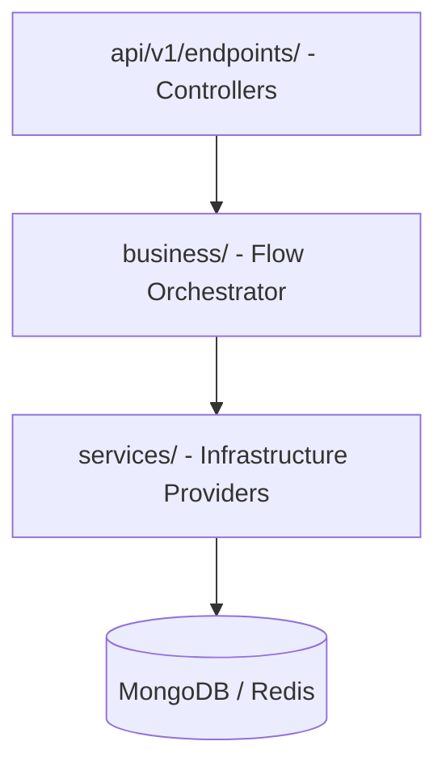

# Jushi Backend - CLAUDE.md

This file defines the commands, architecture, and coding standards for the FastAPI backend (`jushi_backend/`).

---

## 🛠️ Build and Development Commands

Run these commands inside the `jushi_backend/` directory:

- **Activate Virtual Environment**:
  - MacOS/Linux: `source .venv/bin/activate`
  - Windows: `.venv\Scripts\activate`
- **Install Dependencies**: `pip install -r requirements.txt`
- **Start FastAPI Server**: `python start.py` (runs on `http://127.0.0.1:8080` with reload enabled)
- **Run All Tests**: `pytest tests/ -v --tb=short`
- **Run Specific Test File**: `pytest tests/test_sse.py -v --tb=short`
- **Format Code**: `ruff format .` or `black .`

---

## 🏗️ Architecture & Component Design

### 1. Strict Three-Layer Dependency
To ensure codebase maintainability, strictly separate logic into three distinct layers. Code dependencies must only flow in one direction: **Endpoints → Business → Services**.

- **Endpoints (`app/api/v1/endpoints/`)**:
  - Handles route registrations, query parameters, security checks, and HTTP responses.
  - **Rule**: Absolutely **no business logic** or raw database updates here. Keep endpoints extremely thin.
- **Business (`app/business/`)**:
  - The business orchestration layer. Coordinates interactions between multiple services to perform composite tasks (e.g. `chat_business.py` orchestrates routing, RAG retrieval, executing LLM API, and persisting logs).
- **Services (`app/services/`)**:
  - Focused, infrastructure-level utility providers (e.g., `LLMService`, `RagService`, `SSEStreamService`, `SecurityService`).
  - **Rule**: Services must be standalone, easily testable, and must not depend on endpoints.

### 2. Async/Await & MongoDB Integration
- **Async Execution**: The entire backend operates asynchronously. Always write non-blocking async routes and functions (`async def`).
- **Motor (Async MongoDB driver)**: All MongoDB calls must be async. Fetch DB client from `app.database`. Avoid blocking sync PyMongo operations.
- **Redis Cache**: Use Redis for session state, rate limiters, and SSE offset bookkeeping.

### 3. Pydantic v2 Validation
- All request payloads and response bodies must match a Pydantic `BaseModel` located in `app/models/`.
- Use Pydantic v2 decorators (like `@field_validator` and `@model_validator`) for complex custom sanitization and field constraints.
- Provide sensible defaults for optional parameters to ensure backwards compatibility as the database is schema-less.

### 4. SSE (Server-Sent Events) Streaming
- Streaming endpoints must return a `EventSourceResponse` wrapping a generator.
- Use `SSEStreamService` backed by Redis to manage event connection tracking, token tracking, and supporting auto-reconnection via `Last-Event-ID` header.
- Maintain standard events: `start` → `token` (iterative text) → `metadata` → `usage` (Token costs) → `done` / `error`.

---

## 📝 Code Style & Formatting Rules

- **Naming Conventions**:
  - Files and directories: `snake_case.py` (e.g., `chat_business.py`)
  - Function, variable, and method names: `snake_case`
  - Class names: `PascalCase`
- **Logging**:
  - Always use `import logging` and `logger = logging.getLogger(__name__)`.
  - **Rule**: Never use `print()` statements for server logging. Use `logger.info()`, `logger.warning()`, or `logger.error()`.
- **Exception Handling**:
  - Do not let unhandled DB/connection exceptions leak to the client. Raise custom exceptions that FastAPI exception handlers can translate into standardized JSON error responses.
